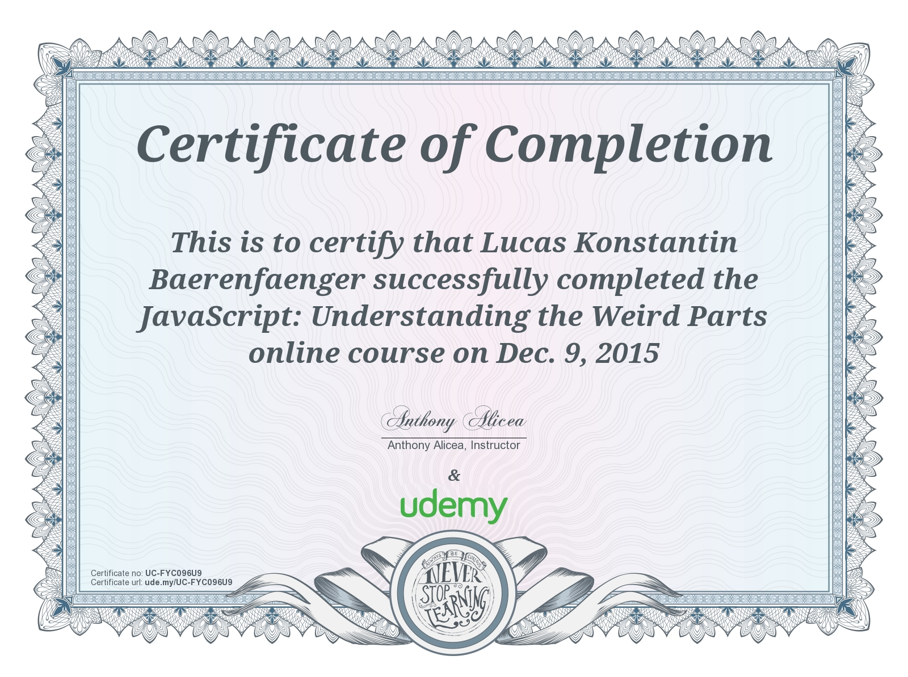

> ### 🚨 My GitHub account name and domain have changed since I created this repository!
> **When I originally created this repository, my GitHub account was `@lambdarookie` and my domain was `lambdarookie.com`.
> These might be referenced within this repository.
> Note that my current GitHub account is `@pygumby` and my current domain is `pygumby.com`.**

# understand-javascript-course-notes

**Notes on and source code from the Udemy course "JavaScript: Understanding the Weird Parts" by Anthony Alicea**

---

* The contents of this repository are based on the Udemy course [JavaScript: Understanding the Weird Parts](https://www.udemy.com/understand-javascript) by Anthony Alicea ([@AnthonyPAlicea](https://github.com/AnthonyPAlicea/), [anthonyalicea.com](https://anthonyalicea.com)).
  This repository only represents a fraction of what is to be found within the course.
  Also, this repository contains many additions and comments that are not part of the course.

---

1. [Usage](#1-usage)
2. [Progress](#2-progress) 
3. [Certificate](#3-certificate)

---

## 1. Usage

Check out `app.js` to see how it's used. It's pretty self-explanatory!

## 2. Progress

I followed along the entire course, however, this repository only contains the final project from section 9 ("Let's Build a Framework /
Library!").

## 3. Certificate

